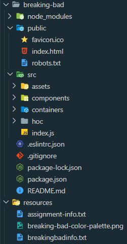
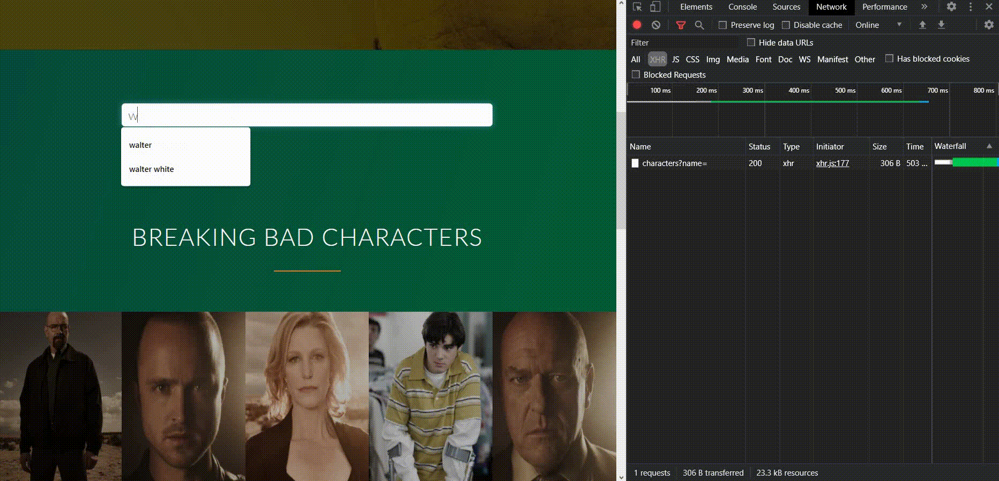

# Breaking Bad Cast

A web application that fetches the breaking bad character details along with the quotes avaialble for each character.<br>
| ReactJS + Breaking-Bad-API |

## Getting Started

These instructions will get you a copy of the project up and running on your local machine for development and testing purposes.

First of all, simply clone/download the project to your local machine location.

## Demo:

The live demo for the application can be found here:
https://breaking-bad-reactapp.herokuapp.com

### Prerequisites

#### Folder Structure

<p align="center">
  
</p>

#### Recommended IDE

**VSCode**  
Others: Atom, Sublime or simply choose as per your comfortability and experience.

#### Knowledge

https://www.reactjs.org

Scripting: ReactJS  
Database: None  
Deployment [Optional]: Possibilities: AWS/Firebase/Localhost/Heroku/Netlify [Used here: [Heroku](https://devcenter.heroku.com/articles/heroku-cli) - Heroku Download]

#### Debouncing

<p align="center">
  
</p>

#### Installed

##### Node Package Manager (NPM)

If you don't have it installed, go ahead and install it. Refer here to follow the steps: https://www.npmjs.com/get-npm

##### ReactJS Library

Download the 'react' and 'react-dom' packages using npm. Also, 'create-react-app' which creates a basic project layout for the application.

```
>> npm i react
>> npm i react-dom
>> npm i create-react-app -g ('-g' tag installs it globally to be accessed from anywhere)

```

### Installation & Setup

A step by step series of examples that tell you how to get a development env running.

#### Installing dependencies

If you are using VSCode pop up the terminal (Ctrl + \`) and make sure you're in the correct folder directory [breaking-bad] (if for some reason you are not, use 'cd + <dir-name>' to visit the required directory).

```
npm i(nstall)
```

##### Packages

**'axios'**: To make HTTP requests to the server's APIs to fetch/save data

**'react-js-pagination'**: To enable pagination (displaying filtered results)

##### Running the project:

After all the dependencies are installed, then run the command 'npm start'. If the code compiled successfully, the following message will be displayed otherwise there's some problem (read the error, resolve it).

```
Compiled successfully!

You can now view breaking-bad in the browser.

  Local:            http://localhost:3000
  On Your Network:  http://network-ip:3000

Note that the development build is not optimized.
To create a production build, use npm run build.
```

##### Deployment

As mentioned above, heroku is being used to deploy the react web application. Tutorials are available on YouTube, I won't be covering them here.

## Further Possibilities

- Improving the basic layout/project structure of the application
- Further separating the business-presentational logic
- About Page (information about the show itself)
- Adding a sticky navigation, that triggers upon scrolling below the header i.e. using waypoints and JS/jQuery

## Built With

- [ReactJS](https://reactjs.org/docs/getting-started.html) - JavaScript Library
- [VSCode](https://code.visualstudio.com/download) - IDE
- [Deploying on Heroku](https://dashboard.heroku.com/) - Cloud Hosting

## Authors

- **Mandeep Singh** - [Ryuk-hash](https://github.com/ryuk-hash)
